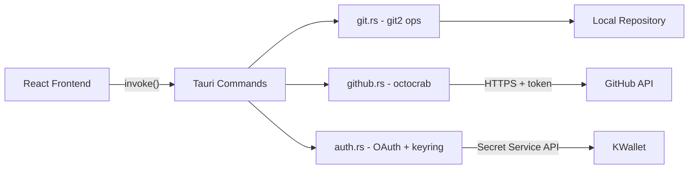

# SourceFlow - 3 Phase Build Plan

A native-feeling, lightweight Git GUI for Fedora/KDE, GitHub-only, modeled on SourceTree's UX but tailored to single-user workflow.

## Target Stack

- **Shell**: Tauri 2 (Rust backend, WebKitGTK WebView)
- **Frontend**: React 18 + Vite + TypeScript
- **UI Kit**: Tailwind CSS + shadcn/ui
- **State**: Zustand (per-tab repo state)
- **Git engine**: `git2` crate (libgit2 bindings)
- **GitHub API**: `octocrab` crate
- **Auth**: GitHub OAuth (PKCE flow) - token stored via `keyring` crate (Secret Service - works with KWallet on KDE)
- **Commit graph**: Custom D3.js SVG with virtualized rendering

## Project Location

`~/Projects/sourceflow`

## System Prerequisites (Fedora KDE)

```bash
sudo dnf install webkit2gtk4.1-devel openssl-devel libsecret-devel
```

## Architecture Sketch



---

# Phase 1 - Working MVP (Foundation)

**Goal**: A genuinely usable single-repo Git client. Open a GitHub repo, browse history, stage and commit changes, fetch/pull/push.

## Deliverables

1. **Tauri 2 + React + Vite + TS scaffold** with Tailwind and shadcn/ui set up
2. **Single-repo view** (no tabs yet, just one repo at a time)
3. **Open repo**: file picker dialog selects a folder, validates it's a git repo
4. **Commit history (flat list)**: scrollable virtualized list (`@tanstack/react-virtual`) of commits with author, date, message subject, short SHA
5. **Branch sidebar** with three sections: LOCAL, REMOTE, STASHES - click branch to checkout
6. **Working Copy view** (separate top-level tab, with dirty indicator):
   - Staged / Unstaged / Untracked file lists
   - Click file -> show full-file diff in right panel
   - Stage / unstage at file level (no hunk staging yet)
   - Commit message textarea + commit button
   - "Amend last commit" checkbox
7. **GitHub OAuth flow** with PKCE - token stored in KWallet via `keyring` crate
8. **Top toolbar** with three real buttons: Pull, Push, Fetch (single-action, no dropdowns yet)
9. **Persistent state**: last opened repo path saved to `~/.config/sourceflow/state.json`

## Module Layout

```
sourceflow/
├── src-tauri/
│   ├── Cargo.toml
│   └── src/
│       ├── main.rs              (Tauri setup, command registration)
│       ├── commands/
│       │   ├── mod.rs
│       │   ├── repo.rs          (open, log, status)
│       │   ├── refs.rs          (branches, checkout)
│       │   ├── stage.rs         (stage/unstage/commit)
│       │   └── remote.rs        (fetch/pull/push)
│       ├── git/
│       │   ├── mod.rs
│       │   ├── repo_handle.rs   (cached Repository wrapper)
│       │   └── credentials.rs   (RemoteCallbacks with token)
│       ├── auth/
│       │   ├── mod.rs
│       │   ├── oauth.rs         (PKCE flow, http listener)
│       │   └── store.rs         (keyring wrapper)
│       └── config.rs            (state.json read/write)
├── src/
│   ├── main.tsx
│   ├── App.tsx
│   ├── components/
│   │   ├── Sidebar/
│   │   │   ├── Sidebar.tsx
│   │   │   ├── BranchTree.tsx
│   │   │   └── StashList.tsx
│   │   ├── Toolbar/
│   │   │   └── Toolbar.tsx
│   │   ├── History/
│   │   │   ├── HistoryView.tsx
│   │   │   └── CommitRow.tsx
│   │   ├── WorkingCopy/
│   │   │   ├── WorkingCopyView.tsx
│   │   │   ├── FileList.tsx
│   │   │   ├── DiffPanel.tsx
│   │   │   └── CommitForm.tsx
│   │   └── Auth/
│   │       └── ConnectGitHub.tsx
│   ├── lib/
│   │   ├── tauri.ts             (typed wrappers around invoke)
│   │   └── types.ts             (shared types matching Rust structs)
│   └── store/
│       └── repoStore.ts         (Zustand)
├── package.json
└── README.md
```

## Phase 1 Acceptance

- I can open a repo, see its history, see what I've changed, stage some files, write a message, commit, and push to GitHub - without any password prompts after the initial OAuth.

---

# Phase 2 - Multi-Repo + Power Features

**Goal**: Daily-driver replacement for SourceTree.

## Deliverables

1. **Multi-repo tabs** with browser-style tab bar
   - Tabs persist across restarts (state.json stores tab list)
   - Dirty indicator dot per tab
   - Middle-click close, drag-to-reorder via `@dnd-kit`
   - `[+]` button with "Recently Closed" dropdown (last 10 repos)
2. **Commit graph (D3.js)** replacing flat list
   - Lane-assignment algorithm for branchy histories
   - Branch/tag badges on commit nodes
   - Click branch badge to checkout
   - Virtualized rendering for 10k+ commits
3. ~~**Hunk-level staging** in DiffPanel~~ → moved to Phase 3 (file-level
   staging covers the daily-driver flow; hunk staging is power-user polish).
4. **Smart toolbar** with split-button dropdowns:
   - Pull (rebase / merge / specific branch)
   - Push (current / all / force-with-lease / tags)
   - Fetch (all / specific remote / prune)
   - Branch (new / checkout / rename / delete)
   - Stash (save / pop / apply specific)
5. **Status indicators on toolbar**: "Push (3)", "Pull (2)", last fetch timestamp
   - Background poll every 60s comparing HEAD vs `@{upstream}`
6. **Right-click context menus** everywhere:
   - On branches: checkout, rename, delete, merge into current, rebase onto, push, set upstream
   - On commits: checkout, branch from here, tag, cherry-pick, reset (soft/mixed/hard), revert
   - On files in Working Copy: discard, open in editor, ignore, view history
7. **Merge / Rebase / Cherry-pick** (non-interactive)
8. **Branch creation dialog** with "checkout new branch" option
9. **Commit detail view**: show full commit, file list, per-file diff

## New Modules

- `src-tauri/src/commands/graph.rs` - serialized graph data for frontend
- `src-tauri/src/commands/stash.rs`
- `src-tauri/src/commands/ops.rs` (merge/rebase/cherry-pick/revert/reset/branch CRUD/tag)
- `src-tauri/src/git/graph_layout.rs` - lane assignment algorithm
- ~~`src-tauri/src/git/patch.rs` - hunk-level patch building~~ → Phase 3
- `src/components/Graph/` - D3 SVG renderer
- `src/components/Tabs/`
- `src/components/ContextMenu/`

## Phase 2 Acceptance

- I can manage 5+ repos in tabs, navigate a complex branchy history visually, stage individual hunks, and perform all common merge/rebase operations through the GUI without dropping to the terminal.

---

# Phase 3 - Polish + Advanced

**Goal**: Better than SourceTree for my workflow.

## Deliverables

1. **Hunk-level staging** in DiffPanel
   - Per-hunk Stage/Unstage buttons
   - Per-line stage (build partial patch and apply via libgit2)
   - Reference GitHub Desktop's implementation for tricky edge cases
2. **Interactive rebase UI**
   - Drag-to-reorder commits
   - Per-commit action dropdown (pick / squash / fixup / edit / drop / reword)
   - Live preview of resulting history
3. **Conflict resolution helper**
   - Conflicted files highlighted in sidebar
   - "Open in editor" launches user's preferred editor (configurable)
   - "Mark resolved" -> `index.add()` -> continue merge/rebase
4. **Stash management UI** with full stash list, preview diff, apply / pop / drop
5. **Tag management** (create lightweight + annotated, push tags, delete local + remote)
6. **GitHub PR integration**
   - Show PR status badges next to branches
   - Create PR from current branch (opens GitHub URL or in-app form)
   - Show CI status on commits
7. **Search**
   - Cmd+P repo switcher across tabs
   - Cmd+F commit search by message / author / SHA / file path
8. **Keyboard shortcuts** (full set, configurable)
   - Ctrl+Enter to commit, Ctrl+Tab to switch tab, etc.
9. **Settings panel**
   - Default pull strategy (rebase vs merge)
   - External editor / diff tool / merge tool paths
   - Theme (auto / light / dark)
   - Polling interval
10. **File history view** - per-file commit log with blame
11. **`.gitignore` editor** with one-click "ignore this file"
12. **Distribution**
    - RPM package for Fedora
    - Flatpak manifest
    - AppImage as fallback

## New Modules

- `src-tauri/src/commands/rebase.rs` (interactive rebase orchestration)
- `src-tauri/src/commands/conflict.rs`
- `src-tauri/src/commands/search.rs`
- `src-tauri/src/commands/pr.rs` (octocrab PR/CI)
- `src/components/Rebase/InteractiveRebase.tsx`
- `src/components/Conflict/`
- `src/components/Settings/`
- `src/components/Search/CommandPalette.tsx`
- `packaging/` (RPM spec, flatpak manifest, AppImage recipe)

## Phase 3 Acceptance

- Production-ready, packaged, distributable. I never need to open SourceTree (or a terminal for git) again.

---

# Cross-Phase Notes

## Auth & Credentials Detail

OAuth PKCE flow:
1. Generate `code_verifier` (random 64 bytes, base64url)
2. Compute `code_challenge` = `BASE64URL(SHA256(code_verifier))`
3. Open browser to `https://github.com/login/oauth/authorize?client_id=...&code_challenge=...&code_challenge_method=S256&scope=repo,read:user&redirect_uri=http://localhost:PORT/callback`
4. Spawn local HTTP listener on ephemeral port to catch the redirect with `code`
5. POST to `https://github.com/login/oauth/access_token` with `code` + `code_verifier`
6. Store token via `keyring::Entry::new("sourceflow", "github_token")?.set_password(&token)`

For git operations against GitHub, build `RemoteCallbacks` that fetches token from keyring and returns `Cred::userpass_plaintext("oauth2", &token)` - libgit2 uses this for HTTPS clone/fetch/push, no popups ever.

**Note**: GitHub OAuth Apps require registering an app and embedding `client_id`. For an open-source local app, this is fine to embed (PKCE means no client_secret needed). Alternative: use GitHub Device Flow for an even simpler UX (`https://github.com/login/device`).

## Risks & Open Questions for Later

- D3 lane-assignment algorithm: needs iteration on real repos with octopus merges
- Hunk staging edge cases (binary files, CRLF, mode changes) - reference GitHub Desktop's implementation
- WebKitGTK quirks with newer CSS features - may need fallback styles
- KWallet first-unlock UX: user sees a KWallet password prompt the first time per session - not avoidable, but expected on KDE